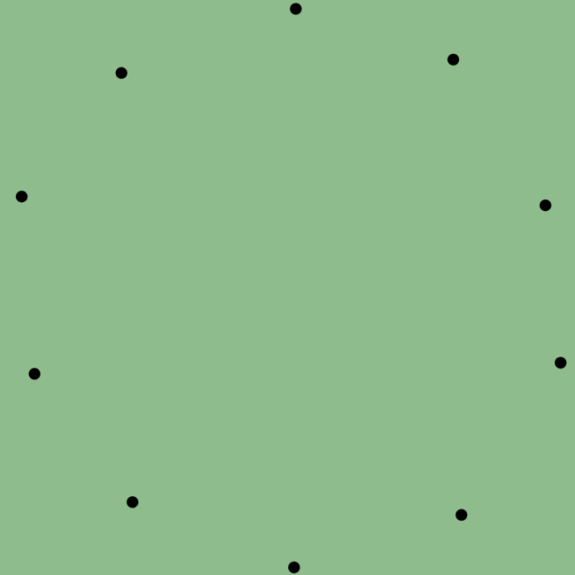
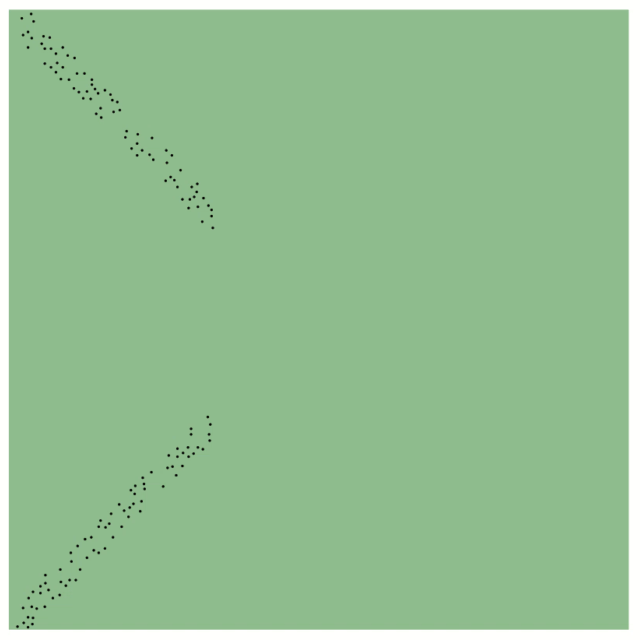
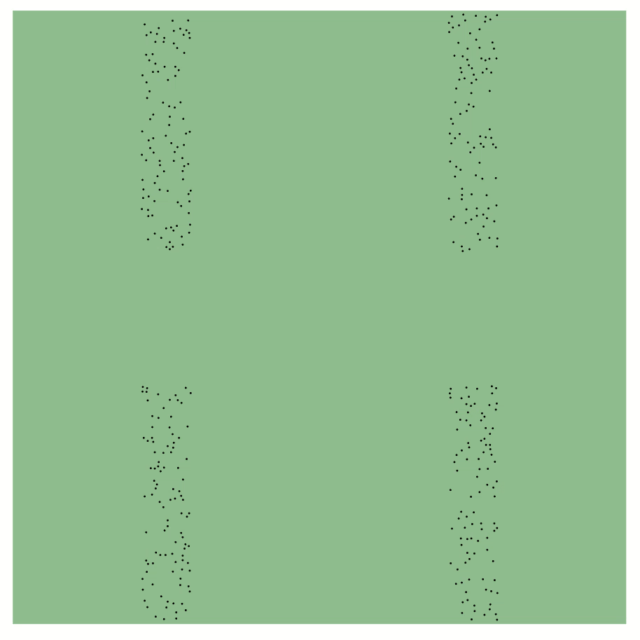

# CUDAmultiagent

Multi-agent simulation based on [Velocity Obstacles](https://en.wikipedia.org/wiki/Velocity_obstacle).

Some examples:

10 agents, circle scenario

150 agents, cross scenario

400 agents, lanes scenario

